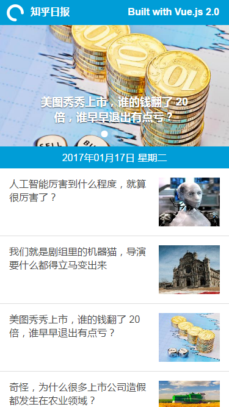

知乎日报 - Vue 2.0 版本 [Live Demo](http://demo.qieguo.me/zhihudaily/)
------

> 知乎日报 - 每天 3 次,每次 7 分钟  
  A Vue.js project for practice  
  项目基于Vue2.0、Vuex、Vue-router、axios、Mint-UI、express等技术框架搭建。

### 后端

后端：一个express框架的代理转发服务器，将请求转发到知乎的服务器上。

**PS：由于知乎对图片也做了防盗链，所以图片也用后端代理请求**

### 前端

前端使用vue2.0搭建的SPA，项目参照 HackerNews Vue2.0，整合了axios、vuex、vue-router、Mint-UI等库，采用webpack（2.x版）打包，没有用服务端渲染做成了前端静态文件。

UI组件尝试使用了饿了么的 [Mint-UI](https://github.com/ElemeFE/mint-ui/)，按需加载所需组件这点做的很好，赞一个！

### Screenshot



### Build Setup

``` bash
# install dependencies
npm install

# develop environment
npm run dev

# build for production with minification
npm run build

# start server for production
npm start

```
